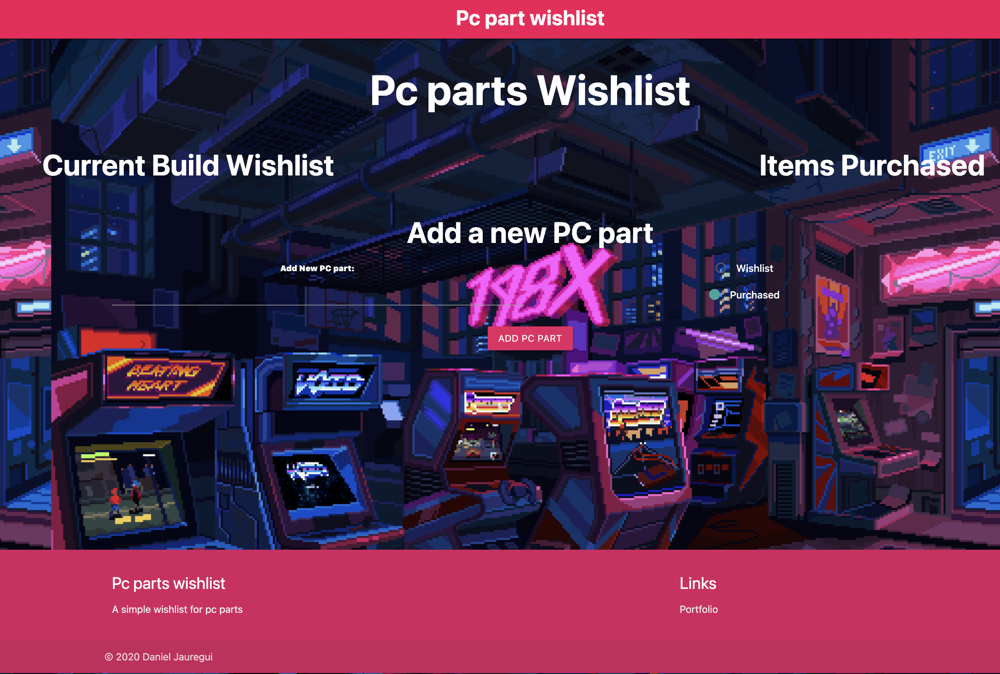

# mySQLTest (Personal Computer Wishlist)
This personal computer wishlist was created as a demostration of MySQL and Object relational mapping. This websites allows a user to input their desired computer part and add it into a wishlist. The aim is to create a ease-of-use list to organize a grocery list of computer parts. There are both sections that were created to distinguish a products status on the wishlist which is "Purchased" and "Current Build Wishlist". 
# Website image


## Deployed link 
* [Live Site](https://mysqltestdan-1a0ce203e9a4.herokuapp.com/)

# Technologies
* Express-handlebars 
* HTML 
* CSS
* Javascript 
* MySQL 
* Object relational mapping
* Heroku 
* Express.js 
* JAWSDB 
* MySQL workbench 


# Installation 
To Install: 
```
git clone <repo link>

npm install 
```
# Author
### Daniel Jauregui 👨‍💻
* [LinkedIn](https://www.linkedin.com/in/kionling/)
* [Github](https://github.com/Kionling)


